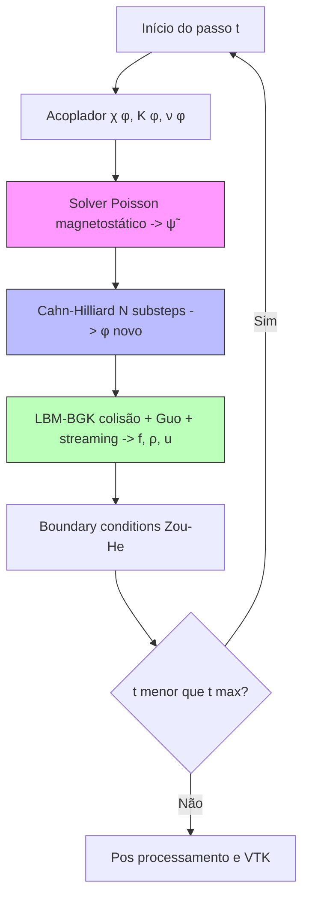

# LBM-PhaseField: Instabilidade de Saffman–Taylor Magnética

Simulação numérica acoplada (multifísica) de **escoamentos bifásicos em
meios porosos sob campo magnético externo**. O código investiga a competição
entre **digitação viscosa** (Saffman–Taylor) e **forças ponderomotrizes
magnéticas** (ferro-hidrodinâmica) em um ferrofluido deslocando um fluido
não-magnético.

A arquitetura é **segregada**: três solvers (LBM-BGK, Cahn–Hilliard, Poisson
magnetostático) são acoplados a cada passo de tempo via campos compartilhados
de fase $\phi$, velocidade $\mathbf{u}$ e potencial perturbador $\tilde\psi$.
Todos os kernels são compilados com Numba (`@njit(parallel=True, cache=True)`).

---

## 1. Ciclo de integração

Cada passo macroscópico $\Delta t$ executa, em sequência:



### Dependências entre módulos

```
              φ        u_phys
              │           ▲
              ▼           │
        ┌──────────┐  ┌──────────┐
        │ χ(φ),    │  │   LBM    │  ← F_capilar (Korteweg)
        │ K(φ)     │  │  (BGK    │  ← F_magnética (Maxwell)
        └────┬─────┘  │  + Guo)  │  ← F_arrasto (Darcy)
             │        └──────────┘
             ▼              ▲
        ┌──────────┐        │
        │ Poisson  │        │  H_total = H_0 - ∇ψ̃
        │   ψ̃     │────────┘
        └──────────┘
             ▲
             │  u_phys
        ┌──────────┐
        │   CH     │
        │ (φ subst)│
        └──────────┘
```

---

## 2. Estrutura do projeto

```text
LatticeBoltzman/
├── main.py                          # Orquestrador do loop temporal
├── casos.json                       # Catálogo de configurações experimentais
├── README.md                        # ← este arquivo
│
├── initialization/
│   ├── initialization.py            # PVI: interface tanh + perfil de Darcy
│   └── Initialization.md            # Documentação teórica + numérica
│
├── lbm/
│   ├── lbm.py                       # Kernel BGK-D2Q9 + Guo + Darcy-Brinkman
│   └── lbm.md                       # Documentação teórica + numérica
│
├── cahn_hilliard/
│   ├── cahn_hilliard.py             # Evolução do campo de fase φ
│   └── cahn_hilliard.md             # Documentação teórica + numérica
│
├── Magnetismo/
│   ├── poisson.py                   # Solver SOR para ∇·(μ_r ∇ψ̃) = H_0·∇μ_r
│   └── poisson.md                   # Documentação teórica + numérica
│
├── Multifasico/                     # Acopladores χ(φ), K(φ), ν(φ)
│
├── lsa/                             # Análise de estabilidade linear (referência)
│   ├── Analise de instabilidade Sem mag Part 1.py
│   ├── Analise de instabilidade Sem mag Part 2.py
│   ├── Analise de instabilidade Sem mag Part 3.py
│   └── Analise de instabilidade com mag.ipynb
│
├── post_process/
│   ├── post_process.py              # Exportação VTK + métricas em tempo de execução
│   ├── captura_curvatura.py         # Captura on-the-fly de κ(t)
│   ├── resultado_curvatura_temporal.py  # κ(t), A(t) → PNG + cache npz
│   ├── valida_lsa.py                # Validação contra Eq. 9 (LSA Darcy magnético)
│   ├── valida_case.py               # Comparação cruzada entre múltiplos casos
│   └── _diagnostico_local.py        # Diagnóstico campo a campo
│
└── Relatorios/                      # Documentação dos pós-processadores
    ├── valida_lsa.md
    ├── resultado_curvatura_temporal.md
    └── metodologia_validacao_lsa.tex
```

---

## 3. Formulação matemática

### 3.1 Hidrodinâmica — LBM-BGK com forçamento de Guo

Equação de Boltzmann discreta (D2Q9):

$$
f_i(\mathbf{x} + \mathbf{c}_i\,\Delta t,\,t + \Delta t)
\;-\; f_i(\mathbf{x}, t)
\;=\;
-\frac{1}{\tau}\bigl[f_i - f_i^{\mathrm{eq}}\bigr]
\;+\; S_i,
$$

com **viscosidade variável** $\nu(\phi)$ (linear ou harmônica em $\phi$) e
$\nu = c_s^{2}(\tau - 1/2)$.

#### Forças acopladas via $S_i$ (Guo)

1. **Capilar (Korteweg / Cahn–Hilliard):**
   $$\mathbf{F}_{c} \;=\; \mu_c\,\nabla\phi,\qquad \mu_c = 4\beta\phi(\phi^{2}-1) - \kappa\,\nabla^{2}\phi.$$

2. **Magnética (Maxwell):**
   $$\boxed{\;\mathbf{F}_{m} \;=\; -\tfrac{1}{2}\,|\mathbf{H}|^{2}\,\nabla\chi\;}$$
   com $\mathbf{H} = \mathbf{H}_0 - \nabla\tilde\psi$ (decomposição de
   Helmholtz: campo de fundo uniforme $+$ perturbação resolvida).

3. **Arrasto de Darcy–Brinkman:**
   $$\mathbf{F}_{D} \;=\; -\,\sigma_{\mathrm{drag}}\,\rho\,\mathbf{u},\qquad
   \sigma_{\mathrm{drag}} = \frac{1}{K\,\lambda_{\mathrm{tot}}},\quad
   \lambda_{\mathrm{tot}} = \frac{k_r^{\mathrm{inv}}}{\nu_{\mathrm{in}}} + \frac{k_r^{\mathrm{res}}}{\nu_{\mathrm{out}}}.$$

📄 Detalhes em [`lbm/lbm.md`](lbm/lbm.md).

### 3.2 Interface difusa — Cahn–Hilliard

Funcional de Ginzburg–Landau:

$$
\mathcal{F}[\phi] \;=\; \int\!\!\left[\beta(\phi^{2}-1)^{2} \;+\; \tfrac{\kappa}{2}|\nabla\phi|^{2}\right] d\Omega,
$$

dinâmica advectiva conservativa:

$$
\frac{\partial\phi}{\partial t} \;+\; \mathbf{u}\!\cdot\!\nabla\phi
\;=\; M\,\nabla^{2}\mu_c.
$$

**Tensão superficial** e **espessura de interface** calibradas via:

$$
\sigma \;=\; \frac{2\sqrt{2}}{3}\sqrt{\kappa\,\beta},\qquad
W \;=\; \sqrt{\kappa/(2\beta)}.
$$

📄 Detalhes em [`cahn_hilliard/cahn_hilliard.md`](cahn_hilliard/cahn_hilliard.md).

### 3.3 Magnetostática — Poisson generalizado

Em ausência de correntes livres, $\mathbf{H} = -\nabla\psi_{\mathrm{total}}$ e
$\nabla\!\cdot\!(\mu_r\nabla\psi_{\mathrm{total}}) = 0$. **Decompondo** o
potencial total como $\psi_{\mathrm{total}} = -\mathbf{H}_0\!\cdot\!\mathbf{r} + \tilde\psi$:

$$
\boxed{\;\nabla\!\cdot\!(\mu_r\,\nabla\tilde\psi) \;=\; \mathbf{H}_0\!\cdot\!\nabla\mu_r\;}
$$

Resolvido por **SOR Gauss–Seidel** com volumes finitos, $\omega \approx 1.85$,
15 iterações por passo (warm start).

📄 Detalhes em [`Magnetismo/poisson.md`](Magnetismo/poisson.md).

### 3.4 Inicialização — sem transiente

Para evitar centenas de timesteps de transiente acústico, a inicialização
impõe **simultaneamente**:

- Interface difusa perturbada: $\phi = -\tanh\!\bigl((x - x_{\mathrm{int}}(y))/W\bigr)$
  com $x_{\mathrm{int}}(y) = x_c + A\cos(2\pi m y/N_y)$.
- **Perfil analítico de Darcy** para $\rho(x)$:
  $$\frac{d\rho}{dx} = -\frac{3\,\nu(\phi)\,u_{\mathrm{inlet}}}{K_0}.$$
- Velocidade uniforme $u_x = u_{\mathrm{inlet}}$.
- Populações em equilíbrio completo $f_i^{\mathrm{eq}}(\rho_{\mathrm{base}},\,u_{\mathrm{inlet}})$.
- $\tilde\psi = 0$ (sem distorção magnética em $t = 0$).

📄 Detalhes em [`initialization/Initialization.md`](initialization/Initialization.md).

---

## 4. Análise de Estabilidade Linear (LSA)

A relação de dispersão adimensional usada como referência teórica para
validação (Saffman–Taylor magnético em meio poroso):

$$
\zeta(\alpha) \;=\;
\alpha\,\frac{M-1}{M+1}
\;+\;
\frac{\mathrm{Da}\,\alpha}{\mathrm{Ca}(1+M)}\,
\Bigl[\mathrm{Bo} - \alpha^{2} + \mathrm{Ca}_m\,\Lambda\,\alpha\,(H_{0n}^{2} - H_{0t}^{2})\Bigr],
$$

com $\alpha = 2\pi m$ (modo $m$), $M = \nu_{\mathrm{out}}/\nu_{\mathrm{in}}$,
$\mathrm{Da} = K_0/N_y^{2}$, $\mathrm{Ca} = \nu_{\mathrm{in}} U_{\mathrm{inlet}}/\sigma$,
$\mathrm{Ca}_m = \chi H_0^{2} N_y/\sigma$, $\Lambda = \chi/(2+\chi)$.

A validação numérica ajusta $A(t) = A_0\,e^{s t}$ no regime linear e compara
$\zeta_{\mathrm{num}} = s N_y/U_{\mathrm{inlet}}$ contra $\zeta_{\mathrm{ana}}$.

📄 Detalhes em [`Relatorios/valida_lsa.md`](Relatorios/valida_lsa.md) e
[`Relatorios/resultado_curvatura_temporal.md`](Relatorios/resultado_curvatura_temporal.md).

---

## 5. Como executar

### 5.1 Pré-requisitos

```bash
pip install numpy numba matplotlib tqdm vtk
```

Requer Python 3.10+ com Numba e suporte a JIT em CPU multi-core.

### 5.2 Rodar uma simulação

Edite os parâmetros desejados em `casos.json` e execute:

```bash
python main.py
```

A simulação cria um diretório de saída nomeado pela configuração
(`OpcaoXX_W{W}_amp{A}_kxi{...}_d{DD}mes{MM}-h{HH}_min{MM}/`) contendo:

- `vtk/dados_macro_NNNNN.vtr` — snapshots dos campos.
- `relatorio_execucao.json` — log estruturado dos parâmetros e da execução.
- `curvatura_temporal.png` / `.npz` — métricas pós-processadas.
- `comparacao_lsa.png` — validação contra a LSA analítica.

### 5.3 Pós-processamento

```bash
# Curvatura e amplitude vs tempo
python post_process/resultado_curvatura_temporal.py <case_dir>/vtk

# Validação LSA
python post_process/valida_lsa.py <case_dir>

# Comparação cruzada entre múltiplos casos
python post_process/valida_case.py <case_dir_1> <case_dir_2> ...
```

---

## 6. Mapa rápido de documentação

| Tópico | Arquivo |
|---|---|
| Visão geral & arquitetura | [`README.md`](README.md) (este) |
| Inicialização do PVI | [`initialization/Initialization.md`](initialization/Initialization.md) |
| Kernel LBM (BGK + Guo + BCs) | [`lbm/lbm.md`](lbm/lbm.md) |
| Cahn–Hilliard (campo de fase) | [`cahn_hilliard/cahn_hilliard.md`](cahn_hilliard/cahn_hilliard.md) |
| Magnetostática (Poisson SOR) | [`Magnetismo/poisson.md`](Magnetismo/poisson.md) |
| Métricas de curvatura/amplitude | [`Relatorios/resultado_curvatura_temporal.md`](Relatorios/resultado_curvatura_temporal.md) |
| Validação LSA | [`Relatorios/valida_lsa.md`](Relatorios/valida_lsa.md) |
| Metodologia formal (LaTeX) | [`Relatorios/metodologia_validacao_lsa.tex`](Relatorios/metodologia_validacao_lsa.tex) |

---

## 7. Convenções globais do código

| Convenção | Valor |
|---|---|
| Rede LBM | D2Q9, $c_s^{2} = 1/3$ |
| Eixo $y$ | **Sempre periódico** em todos os módulos |
| Eixo $x$ — periódico | Controlado por `is_periodic` em LBM e CH |
| Eixo $x$ — não periódico | Zou–He (inlet velocidade, outlet pressão) |
| BCs em $\tilde\psi$ | Neumann em $x$, periódico em $y$ |
| Unidades | Lattice units ($\Delta x = \Delta t = 1$) |
| Float | `float64` (Numba) |
| Paralelização | `prange` sobre $y$ em todos os kernels |
| Buffers | Double-buffer ping-pong em $f$ e $\phi$ |

---

## 8. Referências bibliográficas

1. **LBM-BGK e hidrodinâmica discreta:**
   - Bhatnagar, P. L., Gross, E. P., & Krook, M. (1954). *Phys. Rev.* **94**, 511.
   - Qian, Y. H., d'Humières, D., & Lallemand, P. (1992). *EPL* **17**(6), 479.

2. **Esquema de forçamento de Guo:**
   - Guo, Z., Zheng, C., & Shi, B. (2002). *Phys. Rev. E* **65**, 046308.

3. **Condições de contorno Zou–He:**
   - Zou, Q., & He, X. (1997). *Phys. Fluids* **9**(6), 1591.

4. **LBM em meios porosos (Darcy–Brinkman):**
   - Guo, Z., & Zhao, T. S. (2002). *Phys. Rev. E* **66**, 036304.

5. **Campo de fase e Cahn–Hilliard:**
   - Cahn, J. W., & Hilliard, J. E. (1958). *J. Chem. Phys.* **28**(2), 258.
   - Jacqmin, D. (1999). *J. Comput. Phys.* **155**(1), 96.

6. **Ferro-hidrodinâmica e Saffman–Taylor magnético:**
   - Rosensweig, R. E. (1985). *Ferrohydrodynamics*. Cambridge UP.
   - Saffman, P. G., & Taylor, G. (1958). *Proc. R. Soc. A* **245**, 312.

7. **Métodos iterativos (SOR para Poisson):**
   - Young, D. M. (1971). *Iterative Solution of Large Linear Systems*. Academic Press.
