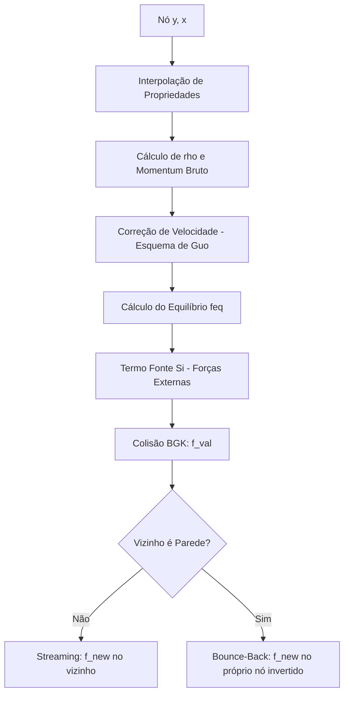

# Documentação Técnica: Kernel LBM (`lbm.py`)

Este módulo implementa o solver hidrodinâmico baseado no **Método de Lattice Boltzmann (LBM)**. Ele acopla a dinâmica dos fluidos (Navier-Stokes) com as forças multifísicas calculadas pelos outros módulos (Capilaridade, Magnetismo e Meios Porosos).

A função principal é decorada com `@njit(parallel=True)` para execução paralela em CPU.

## 1. Visão Geral das Entradas e Saídas

A função `lbm_step` evolui o sistema de $t$ para $t + \Delta t$.

| Parâmetro | Tipo | Descrição Física |
| :--- | :--- | :--- |
| `f` | Tensor $(N_y, N_x, 9)$ | Funções de distribuição de partículas (Populações). |
| `phi` | Matriz $(N_y, N_x)$ | Campo de fase (Define onde está cada fluido). |
| `psi` | Matriz $(N_y, N_x)$ | Potencial Magnético Escalar. |
| `chi_field` | Matriz $(N_y, N_x)$ | Suscetibilidade magnética local $\chi(\phi)$. |
| `K_field` | Matriz $(N_y, N_x)$ | Permeabilidade local do meio poroso. |

---

## 2. Etapa 1: Cálculo do Campo de Forças (Loop Pré-Colisão)

Antes de mover as partículas, calculamos as forças macroscópicas que atuarão sobre o fluido. Este loop percorre os nós internos (`1` a `ny-1`).

### 2.1 Força de Korteweg (Capilaridade)
Derivada do Potencial Químico ($\mu$). Responsável pela tensão superficial e manutenção da interface.

$$\mathbf{F}_s = \mu \nabla \phi$$

| Código | Matemática | Significado |
| :--- | :--- | :--- |
| `mu_c` | $\mu = 4\beta\phi(\phi^2-1) - \kappa\nabla^2\phi$ | Potencial Químico (Bulk + Gradiente). |
| `Fx += mu_c * dx_phi` | $F_x += \mu \frac{\partial \phi}{\partial x}$ | Componente X da força interfacial. |

### 2.2 Força de Kelvin (Magnetismo)
Força ponderomotriz gerada pelo gradiente de suscetibilidade magnética em um campo não-uniforme.

$$\mathbf{F}_m = -\frac{1}{2} (\nabla \psi)^2 \nabla \chi \approx \chi \nabla \left( \frac{1}{2} |\nabla \psi|^2 \right)$$

*No código, usa-se a forma tensorial expandida para eficiência numérica:*

| Código | Matemática Discreta |
| :--- | :--- |
| `hx`, `hy` | Componentes do campo magnético $H_x = -\partial_x \psi$, $H_y = -\partial_y \psi$. |
| `d2psi_...` | Derivadas segundas ($\partial_{xx}\psi$, etc.) usadas para calcular o gradiente de $H^2$. |
| `Fx += chi * (...)` | Aplicação da força proporcional à magnetização local. |

---

## 3. Etapa 2: Colisão e Streaming (Loop Principal)

Este é o "coração" do algoritmo, onde ocorre a relaxação BGK e o transporte.

### 3.1 Fluxograma do Processamento por Célula

### 3.2 Detalhamento das Seções do Loop

#### A. Propriedades de Mistura e Meio Poroso
O modelo assume propriedades variáveis baseadas na concentração local `phi`.

* **Viscosidade:** Interpolação linear entre `TAU_IN` e `TAU_OUT`.
* **Arrasto (Darcy-Brinkman):** Define a resistência do meio.
    * `sigma_drag` $= \frac{\nu}{K}$.
    * Se $K \to \infty$ (fluido livre), `sigma_drag` $\to 0$.
    * Se $K \to 0$ (sólido), `sigma_drag` $\to \infty$.

#### B. Recuperação da Velocidade Física (Esquema de Guo)
Em meios porosos com forças externas, a velocidade "lida" dos momentos do LBM (`ux_l`) não é a velocidade física real do fluido (`ux_phys`).

$$\rho \mathbf{u}_{phys} = \sum f_i \mathbf{c}_i + \frac{\Delta t}{2} \mathbf{F}_{total}$$

No código:
1.  `ux_star`: Adiciona metade da força externa (Korteweg + Kelvin).
2.  `ux_phys`: Divide pelo fator de arrasto geométrico (`1 + 0.5 * sigma_drag`). **Esta é a velocidade usada para advectar o Campo de Fase.**
3.  `Fx_total`: Recalcula a força efetiva subtraindo o arrasto viscoso ($\mathbf{F}_{ext} - \frac{\nu}{K}\mathbf{u}$).

#### C. Operador de Colisão BGK com Forçamento
A equação discreta resolvida é:

$$f_i^{new} = f_i^{old} (1 - \omega) + \omega f_i^{eq} + S_i$$

* `feq`: Distribuição de equilíbrio baseada na velocidade física `ux_phys`.
* `Si`: Termo fonte que insere as forças `Fx_total` na malha de Boltzmann. Sem isso, o fluido não sentiria nem a tensão superficial nem o magnetismo.

#### D. Streaming (Transporte) e Bounce-Back
Move as populações para os vizinhos definidos por `CX` e `CY`.

* **Nó Interno:** `f_new[y+cy, x+cx] = f_val`. A partícula viaja para a célula vizinha.
* **Fronteira Sólida (Y=0, Y=NY-1):** O `if 0 <= be_y < ny` falha.
    * **Ação:** `f_new[y, x, OPP[i]] = f_val`.
    * **Física:** A partícula bate na parede e volta para a **mesma célula** com velocidade invertida (`OPP`). Isso garante velocidade zero na parede (No-slip).

---

## 4. Etapa 3: Condições de Contorno Abertas (Loop Pós-Colisão)

Após o streaming, as bordas esquerda ($x=0$) e direita ($x=N_x-1$) possuem populações faltando (vindas de fora do domínio).

### 4.1 Outlet (Saída - Direita)
Implementa condição de Neumann (Gradiente Nulo) para simular um canal infinito.

* **Código:** `f_new[y, -1, i] = f_new[y, -2, i]`
* **Efeito:** Copia a distribuição da penúltima coluna para a última. Permite que estruturas (bolhas/dedos) saiam do domínio sem reflexão significativa.

### 4.2 Inlet (Entrada - Esquerda)
Implementa condição de Dirichlet (Velocidade Fixa) para injetar fluido.

* **Código:** Recalcula `f_new` usando a fórmula de equilíbrio (`feq`) com velocidade fixa `U_INLET` e densidade local $\rho=1.0$.
* **Efeito:** Força um fluxo constante entrando pela esquerda, empurrando o fluido invasor contra o residente.